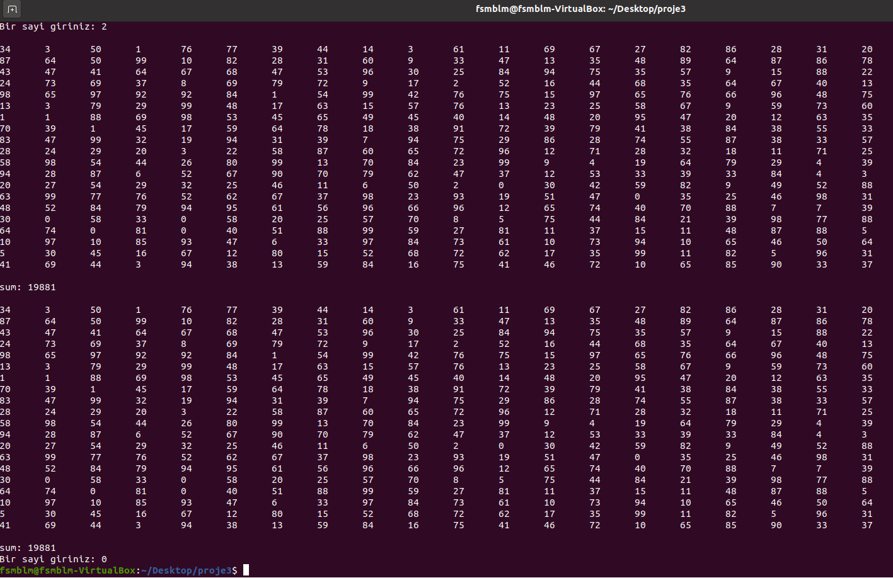

# Thread Senkronizasyonu

Bu proje thread senkronizasyonu konusunun pratiğinin yapılmasını amaçlar. Sistemde “thread_matrix_creator” ve “thread_matrix_sum” adlarında iki adet thread bulunmaktadır. Bir while döngüsü içinde bu threadler çalıştırılarak, kullanıcının istediği sayıda 20x20 matrix ve elemanlarının toplamı ekrana bastırılır. Bunların sırayla çalışması thread senkronizasyonu ile sağlanır.    

